# GraduateManagement
毕业生管理系统 （毕业生就业去向管理平台）/大二上Java期末大作业/2019-2020-1

2019-2020-1学期

《Java程序设计》课程设计文档

## 1. 选题及作品名称

选题：毕业生就业去向管理平台

名称：毕业生管理系统

## 2. 要实现的需求

**用户登录**（学生端和管理员端）：

1. 进行信息项校验，并有登录成功和失败两种提示。

2. 登录后，可对个人信息项进行修改（个人信息项包括：用户名（不可修改）、联系电话、密码和其他）

**人员信息管理**（管理员端）：

1. 管理员可增、删、改、查毕业生的基本信息

2. 管理员可按类查看所有人员列表

**就业登记**（学生端）：

1. 毕业生登录后可进行就业去向登记和修改（就业去向包括待业、研究生、工作单位、创业等）

2. 当选择工作单位、创业时需要登记单位和岗位的基本信息，研究生需要登记学校信息，待业确认去处和联系方式

**信息汇总平台**

1. 按照就业去向分类显示毕业生记录（每一类别按照毕业生的学号倒序排序）

2. 提供搜索功能

3. 进行分类汇总，可以是计数、平均当统计形式，必须要设计的是每届毕业生和各届所有毕业生的男女比例情况、就业岗位分布情况

## 3. 功能模块设计

### 3.1流程设计

+ 用户登录（用户登录模块）

用户根据学工号、密码登录，经校验后根据身份进入不同操作界面。

+ 管理员端
1. 增加毕业生账号（人员信息管理）

进入此界面后会询问1）所添加的账号个数2）所添加毕业生的学号（其中要校验学号的合法性）3）所添加毕业生的姓名、在校时所在的学院、姓名等信息；

2. 删除毕业生账号（人员信息管理）

进入此界面后会询问1）所删除的账号个数2）所删除的毕业生的学号（需校验）；

3. 编辑毕业生信息（人员信息管理）

进入此页面后会询问1）所编辑的毕业生账号（此处校验是否存在）2）所要编辑的信息（此处展示原信息，请用户确认是否编辑）；

4. 查询毕业生信息（信息汇总平台）

进入此页面时会展示现有的学生列表，用户需按学号选择查询；

5. 编辑个人信息（用户登录模块）

进入此页面后需选择编辑的信息；

6. 信息汇总平台（信息汇总平台）

进入此页面后可1）按就业状态查看就业信息2）按性别查看就业信息；

+ 学生端

1.     查看个人信息（用户登录模块）

进入此页面后可查看个人信息（学号、姓名等）与其他信息（性别、原所属学院等）

2.     编辑个人信息（用户登录模块）

进入此页面后需选择编辑的信息；

3.     查看个人就业信息（就业登记模块）

进入页面后，先校验是否登记过就业信息，若已登记过，则显示就业信息，否则，跳转至登记（编辑）就业信息页面；

4.     编辑个人就业信息（就业登记模块）

进入页面后，需选择从业状态，根据从业状态登记不同信息

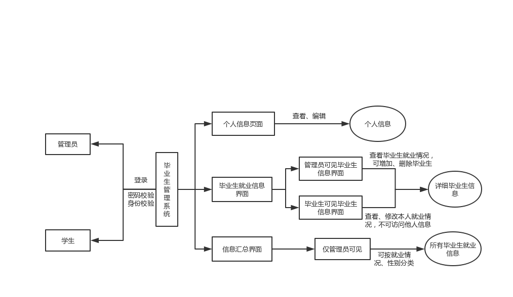

图3-1 毕业生管理系统流程图

## 3.2 界面设计

登录界面

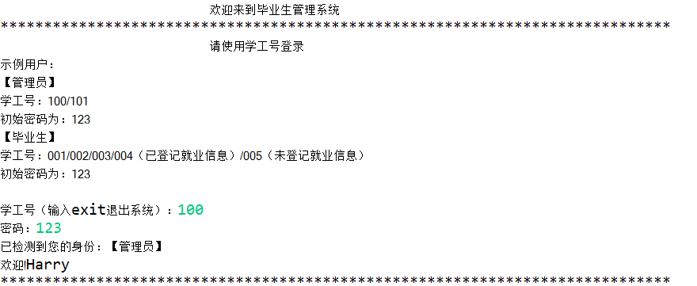

管理员操作界面

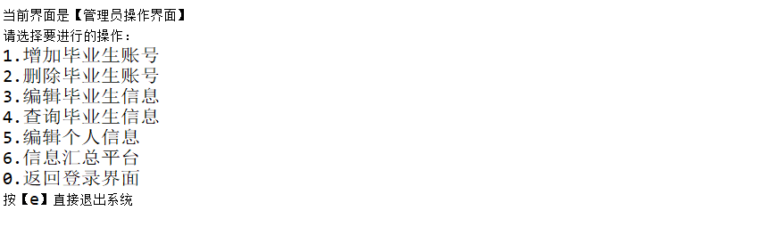

增加毕业生界面

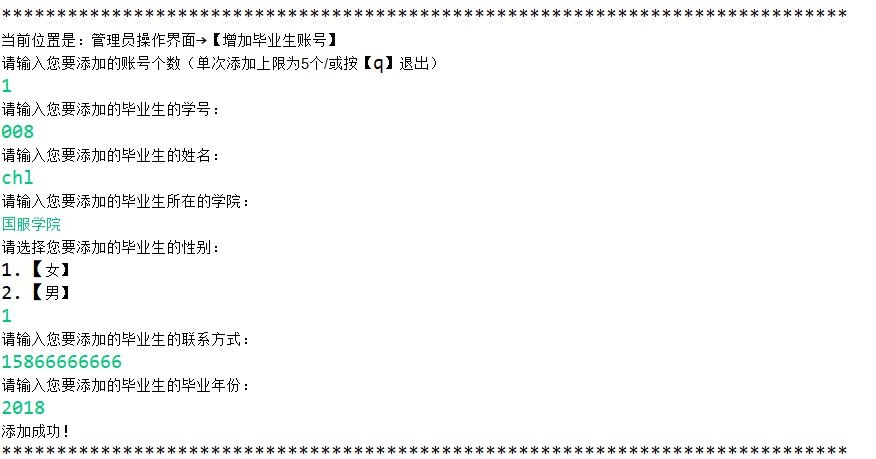

删除毕业生界面

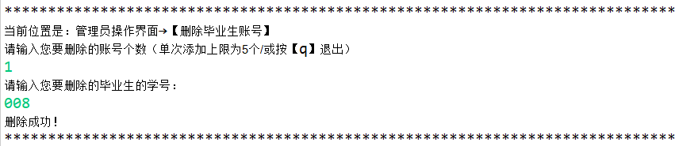

编辑毕业生信息界面

查询毕业生信息

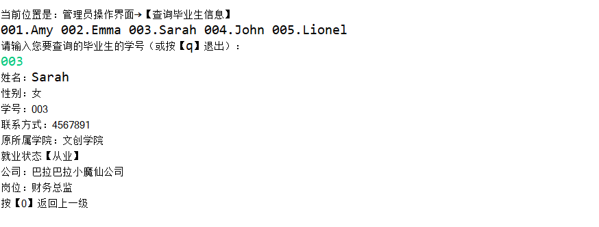

编辑个人信息

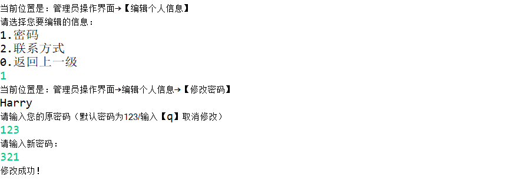

信息管理平台

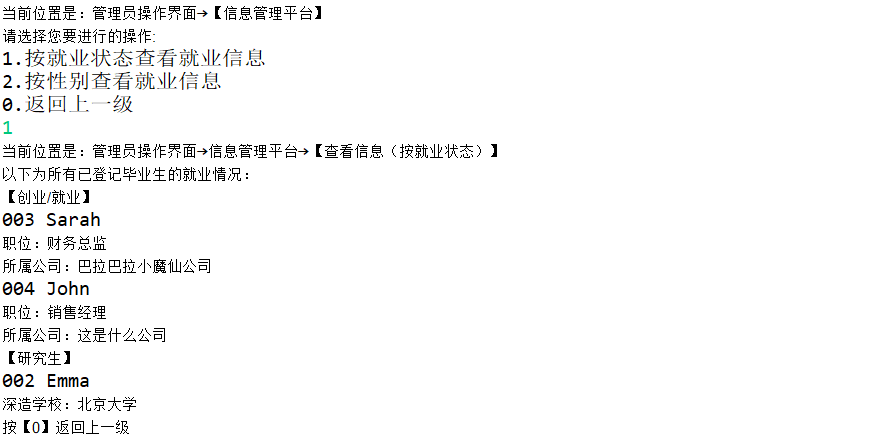

学生操作界面

查看个人信息

查看个人就业信息

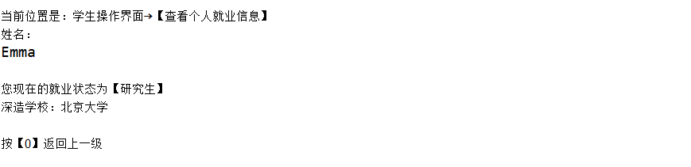

编辑个人信息

## 3.3 功能设计

+ 用户登录（用户登录模块）：本功能主要实现用户的登录功能。用户需要输入学工号和密码。其中，管理员的学工号以1开头，毕业生的学工号除不以1开头外无限制，初始密码均为123。学工号需检测是否存在，密码需与学工号匹配。

+ 增加毕业生账号（人员信息管理）：本功能主要实现毕业生账号的添加。用户需要填写添加账号的个数、待添加毕业生的学号、待添加毕业生的姓名、待添加毕业生在校时所在的学院、待添加毕业生的性别、待添加的毕业生的联系方式。其中，账号个数必须为数字（小于5），学号必须为数字且不以1开头，联系方式必须为数字且大于3位。以上数据项均有校验。本功能在管理员端实现。

+ 删除毕业生账号（人员信息管理）：本功能主要实现毕业生账号的删除。用户需要输入所删除的账号个数、待删除的毕业生的学号。其中，个数与学号均要为数字，学号不可以1开头且必须存在。以上数据均有校验。本功能在管理员端实现。

+ 编辑毕业生信息（人员信息管理）：本功能主要实现毕业生信息的编辑。用户需要输入所辑的毕业生账号（此处校验是否存在）、所要编辑的信息（此处展示原信息，请用户确认是否编辑）。本功能在管理员端实现。

+ 查询毕业生信息（信息汇总平台）：本功能主要实现对毕业生的查询。用户需要输入待查询毕业生的学号。本功能在管理员端实现

+ 编辑个人信息（用户登录模块）：本功能主要实现个人信息的编辑。用户需要选择待编辑的信息。本功能在管理员端与学生端均有。

+ 信息汇总平台（信息汇总平台）：本功能主要实现对毕业生信息的汇总。用户需要选择分类汇总的依据。选择后，页面会显示所有毕业生的就业信息。本功能在管理员端实现。

+ 查看个人信息（用户登录模块）：本功能主要实现个人信息的查看。选择该项后，页面会显示本用户的个人信息（姓名、学号、联系方式、所在学院等）。本功能在学生端实现。

+ 查看个人就业信息（就业登记模块）：本功能主要实现个人就业信息的查看。选择该项后，页面会显示本用户的就业状态和具体信息。若未登记过就业信息，则直接跳转至编辑页面。本功能在学生端实现。

+  编辑个人就业信息（就业登记模块）：本功能主要实现个人就业信息的编辑。

用户选择该项后，需选择从业状态，根据从业状态登记不同信息。本功能在学生端实现。

 

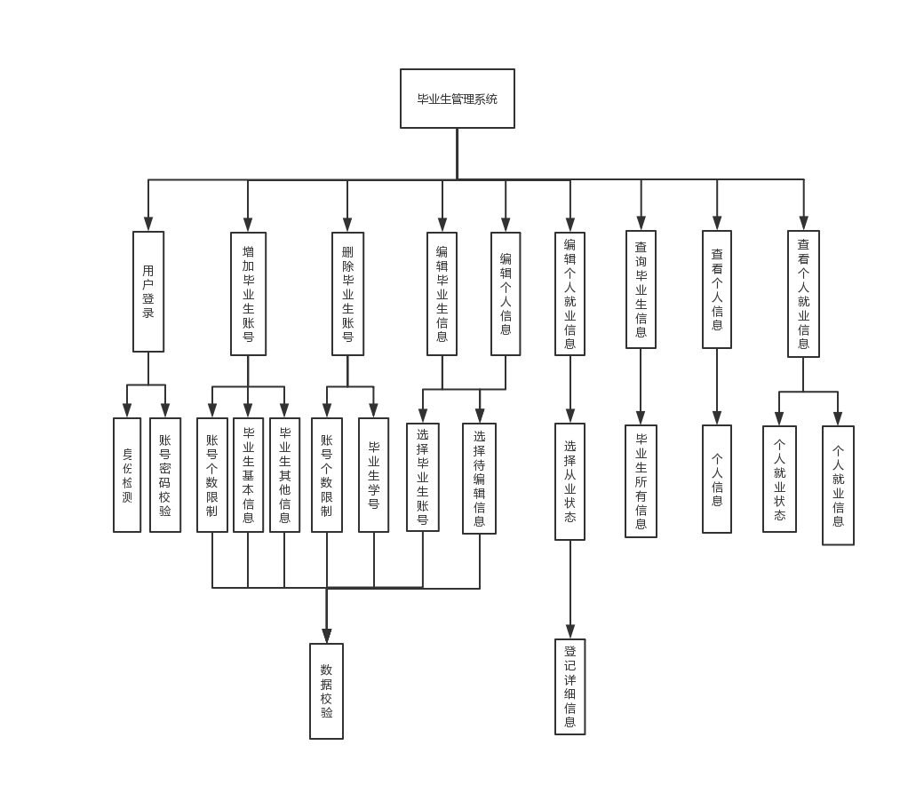

图3-2 功能层次图

 

## 3.3 数据库设计

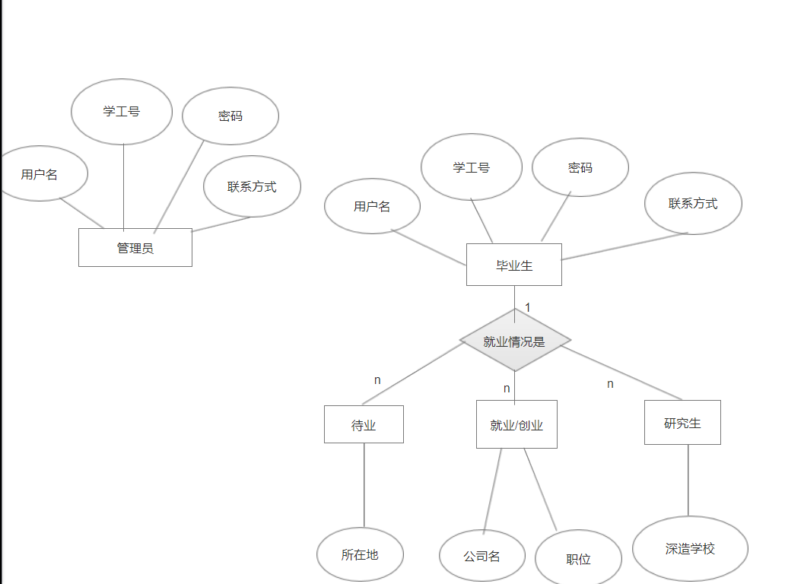

 